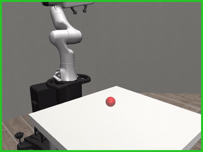
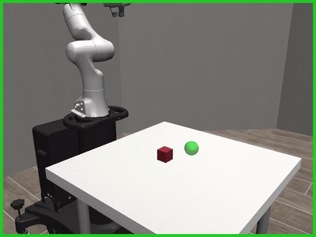
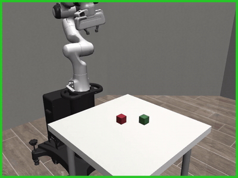
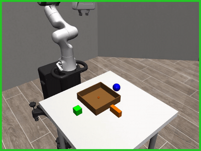
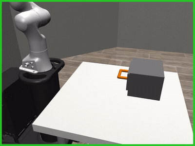
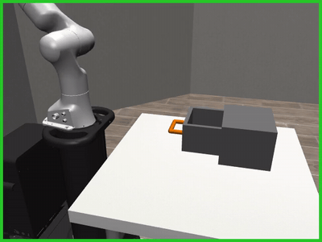
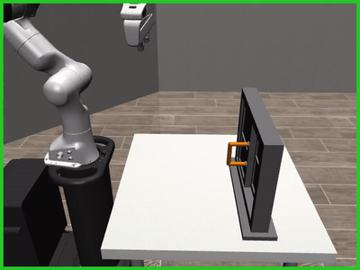
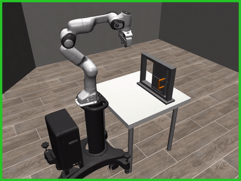
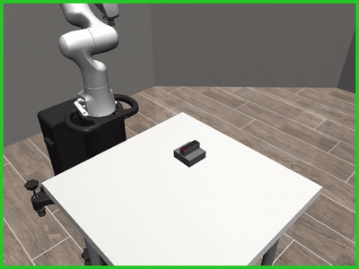
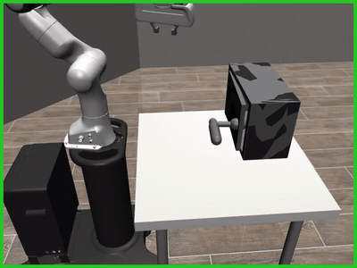

# Differentiable Reinforcement Learning in Aerial Manipulation

First-order analytic policy gradients (BPTT) through differentiable physics for Franka Emika Panda manipulation, implemented in MuJoCo MJX (JAX).

Policies are trained by backpropagating the task reward directly through the physics simulator — exact analytic gradients of the return with respect to the policy parameters, rather than estimates from sampled rollouts (as in PPO). A single policy serves every task: a **shared trunk** plus one **head per motion primitive** (`reach`, `grasp`, `pull_drawer`, …), so every task that reaches trains the same `reach` head. The policy is trained either from **state** (exact object coordinates from the simulator) or from **vision** (frozen DINOv3 features of a 64×64 wrist-camera image).

---

## Results

Each clip is one evaluation episode of a separately trained checkpoint — click it for the full recording, five episodes sampled one per 20 of the 100 evaluation trials. A **green** frame means the episode met its final segment's criterion, **red** that it did not. In *Reach* and *Pick and place* the translucent sphere is the goal, drawn at the success-threshold radius (3 cm).

<table>
<tr>
<td align="center" width="50%">
<a href="videos/reach.mp4"></a><br>
<b>Reach</b> · state<br>
<code>reach</code> · 35 steps
</td>
<td align="center" width="50%">
<a href="videos/pick_and_place.mp4"></a><br>
<b>Pick and place</b> · state<br>
<code>reach → descend → grasp → move</code> · 90 steps
</td>
</tr>
<tr>
<td align="center">
<a href="videos/cube_stacking.mp4"></a><br>
<b>Cube stacking</b> · state<br>
<code>reach → descend → grasp → move → release</code> · 100 steps
</td>
<td align="center">
<a href="videos/container_vision.mp4"></a><br>
<b>Container sorting</b> · vision<br>
<code>3 × (reach → descend → grasp → move → release)</code> · 270 steps
</td>
</tr>
<tr>
<td align="center">
<a href="videos/drawer_open.mp4"></a><br>
<b>Drawer open</b> · state<br>
<code>reach → grasp → pull_drawer</code> · 80 steps
</td>
<td align="center">
<a href="videos/drawer_close.mp4"></a><br>
<b>Drawer close</b> · state<br>
<code>reach → grasp → push_drawer</code> · 80 steps
</td>
</tr>
<tr>
<td align="center">
<a href="videos/window_open.mp4"></a><br>
<b>Window open</b> · state<br>
<code>reach → grasp → slide_open</code> · 80 steps
</td>
<td align="center">
<a href="videos/window_close.mp4"></a><br>
<b>Window close</b> · state<br>
<code>reach → grasp → slide_close</code> · 80 steps
</td>
</tr>
<tr>
<td align="center">
<a href="videos/dial_turn.mp4"></a><br>
<b>Dial turn</b> · state<br>
<code>reach → descend → grasp → turn</code> · 115 steps
</td>
<td align="center">
<a href="videos/door_open.mp4"></a><br>
<b>Door open</b> · state<br>
<code>reach → grasp → swing</code> · 110 steps
</td>
</tr>
</table>

One control step is 0.04 s (4 physics substeps of 10 ms). Every task, its segments, rewards and success criteria are defined in [`configs/tasks_state.yaml`](configs/tasks_state.yaml) (state) and [`configs/tasks.yaml`](configs/tasks.yaml) (vision).

---

## Method

### Backpropagation Through Time (BPTT)

The policy maps observations to joint velocity commands and a gripper target. The entire rollout — observation → policy → physics step → reward — forms a differentiable computation graph, and `jax.grad` computes exact gradients of the cumulative reward with respect to all policy parameters in a single backward pass.

```
obs → policy → joint velocities → mjx.step → next state → reward
 ↑                                    ↓
 └───────────── jax.lax.scan ─────────┘
                     ↓
           jax.grad(total_reward) → parameter update
```

### Primitive Policy: Shared Trunk + Per-Primitive Heads

Each task is a sequence of segments, and each segment is driven by one of 14 primitives:
`reach, descend, grasp, move, release, align, insert, pull_drawer, push_drawer, push_object, slide_open, slide_close, turn, swing`.
Heads are keyed by primitive name rather than by segment index, so a head accumulates gradient from every task that uses it.

```
State   obs: 25 proprio + 6 object slots × 3 ──────────────────────────┐
                                                                        ├→ shared trunk → head[active primitive] → joint velocities + gripper
Vision  camera 64×64 → DINOv3 (frozen) → projection → spatial softmax ─┤
        proprio (31) ───────────────────────────────────────────────────┘
```

- **Trunk:** 256 hidden units, shared by every task.
- **Heads:** 2 hidden layers each, width scaled by how many segments use the primitive (16 per segment, at least 32). Output is tanh-scaled joint velocities and a sigmoid finger target.
- **State observation (43 dims):** end-effector position and velocity, finger width, joint positions and velocities, end-effector orientation, plus six fixed-width object slots (a body/site/mocap position, or `[q, target, target − q]` for an articulated joint). Unused slots are zero, so one trunk and one normaliser serve every task.
- **Vision observation:** the `robot0_eye_in_hand` camera rendered on the GPU with MJWarp, DINOv3 (`vit_base_patch16_dinov3`, frozen) → 4×4 patch grid of 768-d features → projection to 128 channels → spatial softmax, concatenated with 31-dim proprioception.

### Segmented Credit Assignment

At every segment boundary `jax.lax.stop_gradient` cuts the gradient chain and the discount restarts. This addresses BPTT's core weakness — gradients vanishing or exploding over long horizons — while keeping exact gradients within each segment. Each primitive is credited only for its own segment, under its own reward.

```
[reach]──stop_grad──[grasp]──stop_grad──[pull_drawer]
   ↑ reach head         ↑ grasp head        ↑ pull_drawer head   (shared across tasks)
   ↑ own reward         ↑ own reward        ↑ own reward
```

### Curriculum

Segments unlock one phase at a time: steps past the active horizon are frozen. The next segment unlocks once at least 50% of the batch meets the current segment's criterion for 2 consecutive evaluations. Task success counts only on full-length rollouts, and a run stops once every task holds ≥ 80% success for 4 consecutive evaluations.

### Multi-Task Optimisation

All selected tasks train together: one combined loss, one `value_and_grad`, one backward pass through the shared trunk and every head. Each task keeps its own MJX model, batch and curriculum phase. The trunk gets a global-norm-clipped Adam; each primitive head gets its own optimizer and its own clip.

### Vision: Chunked Rendering

Rendering and DINOv3 run outside JAX, so a vision iteration has two phases. First the episode is rolled forward chunk by chunk (5 steps), rendering once per chunk and caching the features. Then BPTT replays the episode against that cache, which keeps the renderer out of the backward graph.

### Gradient Checkpointing

`jax.checkpoint` (rematerialization) is applied at two levels — frame steps and physics substeps. During the backward pass, intermediate activations are recomputed on the fly instead of being stored, reducing VRAM usage by approximately 4× at a ~1.5× compute cost.

### Observation Normalization

A running mean/variance estimator normalizes observations online; for state observations a variance floor keeps constant dimensions (e.g. unused object slots) from being blown up. Statistics are updated each iteration from the rollout observations returned via `has_aux=True`, avoiding an extra forward pass.

---

## Baselines and Ablations

- **PPO** ([`ppo_baseline/`](ppo_baseline)): the same state environment, network, reward and curriculum, trained with PPO (rsl_rl) instead of analytic gradients. The network is ported to PyTorch and checked against the JAX original by `verify_policy_match.py`.
- **Ablations** (vision trainer flags, all run on cube stacking), with checkpoints and learning curves under `train_robosuit/Plots and Checkpoints/`:
  - `--no-curriculum` — every segment active from iteration 0 (`no-curriculum/`)
  - `--full-chain` — no gradient cut at segment boundaries; run together with `--no-curriculum`, so it compares against the run above (`full-chain/`)
  - `--monolithic` — one fully-connected MLP with the primitive as a one-hot input instead of per-primitive heads (`fully-connected-MLP/`)

---

## Key Technical Details

### MJX Solver Patch

MJX's constraint solver uses `jax.lax.while_loop`, which does not support reverse-mode automatic differentiation. A monkey-patch replaces it with `jax.lax.fori_loop` using a fixed iteration count, making the solver fully differentiable.

### Mixed Precision

Physics runs in float64 (`jax.config.update("jax_enable_x64", True)`) to avoid NaN gradients in contact resolution. The policy runs in float32 for efficiency. Observations are cast to float32 before entering the network.

### Shaped Distance Reward

A reward shaping function provides smooth gradients at all distances:

```python
def shaped_distance(a, b, s, t):
    dist = sqrt(dot(a - b, a - b) + 1e-6)
    scale = 1.8318 / max(s, 1e-6)
    shaped = (1.0 - tanh(dist * scale)) ** 2
    return where(dist < t, 1.0, shaped)
```

The parameter `s` controls the gradient falloff width, `t` is the "close enough" threshold below which the reward saturates to 1.0. The per-primitive rewards in [`rewards/primitive_rewards.py`](rewards/primitive_rewards.py) are built from it.

### MJX Constraints

- Cylinder collision is not supported — use capsule or box
- Box-box SAT contact can produce NaN gradients — use capsule for peg-like objects, or use sphere geometry where possible
- `margin` and `gap` geom attributes cause vibration — remove them
- `max_contact_points` must be increased (via `<custom><numeric>`) for multi-object scenes
- Asset includes must be flat (no nested includes) to avoid MuJoCo's path doubling bug

---

## Running

### Prerequisites

```
Python 3.10+
JAX with GPU support
MuJoCo >= 3.0, with MJX (and MJWarp for vision)
optax
PyTorch + timm       (vision: DINOv3 backbone)
rsl_rl               (PPO baseline)
ffmpeg               (evaluation recordings)
```

### Training

```bash
cd train_robosuit

# State — one task (opens a MuJoCo viewer replaying env 0), or several jointly
python train_primitives_state.py --tasks drawer_open
python train_primitives_state.py --tasks all --batch 20 --grad-groups 11

# Vision
python train_primitives_vision.py --tasks drawer_open
python train_primitives_vision.py --tasks all --batch 10 --grad-groups 11

# Tasks retired from the joint sweep train on their own
python train_primitives_vision.py --tasks container --out-prefix container_vision

# PPO baseline
python ../ppo_baseline/train_ppo.py --task cube_stacking
```

Params, observation statistics and learning/gradient plots are saved every 50 iterations and on exit (including Ctrl+C). `--no-viewer` suppresses the viewer.

### Evaluation

```bash
cd train_robosuit/Eval

python eval_primitives_state.py --tasks drawer_open --run "Drawer open"
python eval_primitives_vison.py --tasks container \
    --ckpt-root "../Plots and Checkpoints/hard_tasks" --run vision_container
```

Each task is evaluated on 100 trials (5 batches of 20) under its own success criterion. A single-task eval opens a MuJoCo viewer that replays env 0 of each batch, and writes the same replays to `eval_<task>.mp4` next to the checkpoint — the videos in this README. `--no-viewer` runs headless (still recording), `--no-record` skips the video.

---

## Repository Layout

```
configs/          task definitions: robot, primitives, segments, rewards, criteria
envs/             one environment class per task family (base.py vision, state_base.py state)
models/           primitive_policy.py (vision), state_policy.py (state), vision_backbone.py (DINOv3)
rewards/          per-primitive reward functions
helpers/          MJX solver patch, observation normalisation, XLA settings
train_robosuit/   trainers; Eval/ (evaluation + recording); Plots and Checkpoints/
ppo_baseline/     PPO baseline; ppo_runs/ holds its runs
assets/           MuJoCo XMLs, meshes, textures
videos/           the evaluation recordings shown above
old_files/        earlier per-task scripts, superseded
```

---

## References

- SHAC: Xu et al., "Accelerated Policy Learning with Parallel Differentiable Simulation," ICLR 2022
- SAPO / Rewarped: entropy regularization for differentiable RL
- DiffSkill: Lin et al., "DiffSkill: Skill Abstraction from Differentiable Physics," ICLR 2022
- STAP: Agia et al., "STAP: Sequencing Task-Agnostic Policies," ICRA 2023
- Suh et al., "Do Differentiable Simulators Give Better Policy Gradients?", ICML 2022
- MuJoCo MJX: Freeman et al., JAX-based differentiable physics
